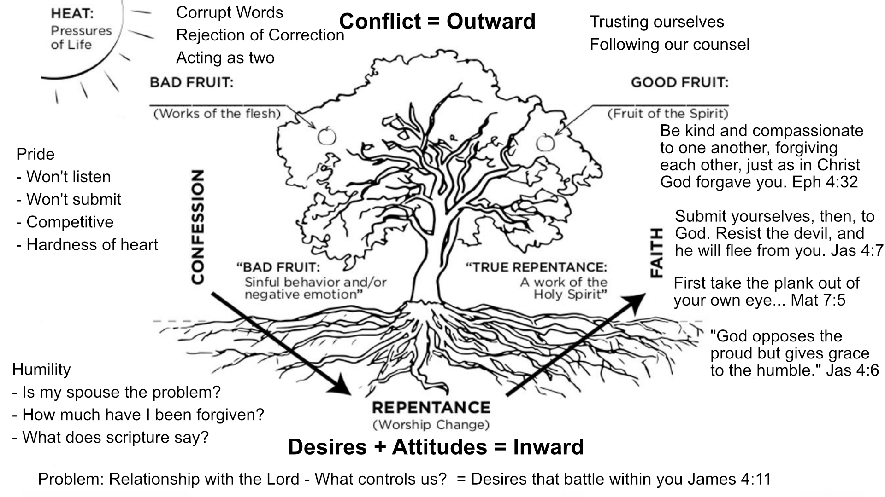

# Catching Foxes

Pre-engagement counseling - start working on critical issues now, and plan to resolve them prior to engagement

History (of yourself and spouse) provides context:

Gives you perspective

Allows you to understand each others' vulnerabilities

## Chapter 1 - Personal History

Gospel is the power of God for salvation Rom 1:16

Scripture allows us to :

-   Interpret our history truthfully

-   Respond to our history triumphantly

-   Behold the glory of Christ shining through

God uses our experiences for our good

-   Experiences do not control us

-   God controls our life and destiny

> II Cor 5:14 For the love of Christ controls us, because we have concluded this: that one has died for all, therefore all have died;

History does not determine who you are, but has influenced the way you think, feel, and live and have impacted your view of the world.

Now is the time to honestly discuss secrets from your past - now is the time to be honest

## Chapter 2

Framework for seeing marriage within a larger context:

-   Christ-centered
-   God-exalting
-   Spirit-dependent

Creation- Designed to display and share his glory

> Ps 19:1-6 The heavens are telling of his glory

> Col 1:16-17 For by him all things were created, in heaven and on earth, visible and invisible, whether thrones or dominions or rulers or authorities—all things were created through him and for him.And he is before all things, and in him all things hold together.

Our personal lives are part of God's redemptive plan

> I Cor 10:31 Whether, then, you eat or drink or whateveryou do, do all to the glory of God

> Ephl:4-6 even as he chose us in him before the foundation of the world, that we should be holy and blameless before him. In love ^**5**^ he predestined us for adoption to himself as sons through Jesus Christ, according to the purpose of his will, ^**6**^ to the praise of his glorious grace, with which he has blessed us in the Beloved.

> I Tim 1:15-17 ^**15**^ The saying is trustworthy and deserving of full acceptance, that Christ Jesus came into the world to save sinners, of whom I am the foremost. ^**16**^ But I received mercy for this reason, that in me, as the foremost, Jesus Christ might display his perfect patience as an example to those who were to believe in him for eternal life. ^**17**^ To the King of the ages, immortal, invisible, the only God, be honor and glory forever and ever.Amen.

-\> Paul was saved not only for his sake, but for God's glory and eternal purposes

> Acts 17:24-28: ^**24**^ The God who made the world and everything in it, being Lord of heaven and earth, does not live in temples made by man, ^**25**^ nor is he served by human hands, as though he needed anything, since he himself gives to all mankind life and breath and everything.^**26**^ And he made from one man every nation of mankind to live on all the face of the earth, having determined allotted periods and the boundaries of their dwelling place, ^**27**^ that they should seek God, and perhaps feel their way toward him and find him. Yet he is actually not far from each one of us, ^**28**^ for
>
> “‘In him we live and move and have our being’
>
> as even some of your own poets have said,
>
> “‘For we are indeed his offspring.’

We are created to worship and enjoy God

### Questions:

| **Page 47 - Question #4 “What do you think it means to seek Christ and his Kingdom in your marriage?**\\

## Chapter 3

> Gen 1:26-27: ^**6**^ Then God said, “Let us make man in our image, after our likeness. And let them have dominion over the fish of the sea and over the birds of the heavens and over the livestock and over all the earth and over every creeping thing that creeps on the earth.”
>
> ^**27**^ So God created man in his own image,\
>     in the image of God he created him;\
>     male and female he created them.

1\) We are purposed by God to exist

2: He decided in his mind to form the world anc created us in his likeness

3\) God declared the creation of humans as good.

=\> Every person has God-designed beauty - dignity

Learn to seek God above all else

Learn to be satisfied in Jesus

### FALLEN NATURE

Gen 3:6-7

We revolted -\> humanity died

We began running from God rather than to God

Sinful nature is more than a history of sin

We have adopted a way of Life that devalues God and exults self placed as ruler and savior of our life.

> ROm 7:21-25: ^**21**^ So I find it to be a law that when I want to do right, evil lies close at hand. ^**22**^ For I delight in the law of God, in my inner being, ^**23**^ but I see in my members another law waging war against the law of my mind and making me captive to the law of sin that dwells in my members. ^**24**^ Wretched man that I am! Who will deliver me from this body of death?^**25**^ Thanks be to God through Jesus Christ our Lord! So then, I myself serve the law of God with my mind, but with my flesh I serve the law of sin.

Who loves you enough to tell you you're walking against Christ?

### Corrupted Desires

#### Lust (more than just sexual) James 4:1-2

Source of quarrels: Lusts

#### Fear - an expression of worship (The thingswe fear have power over us)

Lust & Fear go

hand in hand longings -\> fear of missing out

#### Futile attempts to reconcile ourselves to God

Inability to reconcile ourselves to God -\>\> Adam and Eve attempted to cover w/ Skins -\> Hiding From God -\> Blaming one another

### REDEMPTION

Old testament provided temporary deliverance through the shedding of blood.

> Rom 3:21-22 ^**21**^ But now the righteousness of God has been manifested apart from the law, although the Law and the Prophets bear witness to it— ^**22**^ the righteousness of God through faith in Jesus Christ for all who believe. For there is no distinction:

Salvation is more than freedom from sin and death -\> New peaceful relation w/ God

> II Cor 5:14-15: ^**14**^ For the love of Christ controls us, because we have concluded this: that one has died for all, therefore all have died; ^**15**^ and he died for all, that those who live might no longer live for themselves but for him who for their sake died and was raised.

### NEW PERSON

| Questions: #7 What do you tend to run after for comfort, refuge, and deliverance? Do you run to sports, career, isolation, or something else?

The reality of eternal life, when we consider it truthfully and often enough, controls the way that we live in this present life.

### Questions:

| What kind of rhythms do you have set in your lives for regular accountability - encouragement in a life of repentance and obedience?
| Page 58 - Question #7 “What do you tend to run after for comfort, refuge, or deliverance? Do you run to sports, food, career, isolation, or something else?”

## Chapter 4

Do you carry a zeal for the eternal purposes of God?

Purpose of Marriage

> Gen 2:18-25: ^**18**^ Then the Lord God said, “It is not good that the man should be alone; I will make him a helper fit for him.” ^**19**^ Now out of the ground the Lord God had formed every beast of the field and every bird of the heavens and brought them to the man to see what he would call them. And whatever the man called every living creature, that was its name. ^**20**^ The man gave names to all livestock and to the birds of the heavens and to every beast of the field. But for Adam there was not found a helper fit for him. ^**21**^ So the Lord God caused a deep sleep to fall upon the man, and while he slept took one of his ribs and closed up its place with flesh. ^**22**^ And the rib that the Lord God had taken from the man he made into a woman and brought her to the man. ^**23**^ Then the man said,
>
> “This at last is bone of my bones and flesh of my flesh;\
> she shall be called Woman, because she was taken out of Man.”
>
> ^**24**^ Therefore a man shall leave his father and his mother and hold fast to his wife, and they shall become one flesh. ^**25**^ And the man and his wife were both naked and were not ashamed.

Marriage doesn't belong to the couple, but belongs to God

No helper suitable for him

For this reason: Leave + cleave

Created to know, enjoy, worship God

Not good to be alone - God was part of a family

Adam had one to love/serve

AND There was no helper suitable for him

Everything created exists to glorfy God

Alone, Adam couldn't display the image of God

Marriage is a gift from God (to be stewarded) for his purposes. =\> God is with us, for us, and committed to our marriages

Marriage is a covenant which pictures, embodies, and points to the eternal covenant between

Christ and the church.

Manage exists as a means of multiplying

Marrage exists to exhort the next generation

But spirtual multiplication is primary -\>

Covenant

Go and make disciples

### Questions:

| Page 73 - Questions #1-2 Explain what “Let no man separate” means to you
| What difficulties do you foresee in leaving your original family in order to be joined to your husband or wife? Share ways in which you could be too attached to or dependent upon your father, mother, or siblings - whether this involves their approval, respect, money, or advice
| Page 77 - Questions #5-6 Share your desires for having children or not having children Share your fears about having children

## Chapter 5 Covenant

```         
 “Christian marriage should be distinguished from other kinds of marriage not by the absence of sin but by the presence of redeeming and reconciling grace” (pg 95).
```

Noah \~ Rainbow was a sign

Abraham\~ Circumcision

Law as book of the covenant Ex 24:7

New covenant foretold

> Jer 31:33-34 ^**33**^ For this is the covenant that I will make with the house of Israel after those days, declares the Lord: I will put my law within them, and I will write it on their hearts. And I will be their God, and they shall be my people. ^**34**^ And no longer shall each one teach his neighbor and each his brother, saying, ‘Know the Lord,’ for they shall all know me, from the least of them to the greatest, declares the Lord. For I will forgive their iniquity, and I will remember their sin no more.”

### COVENANT

Noahic Covenant

Abrahamic Covenant

### New Covenant

> For this reason Christ is the mediator of a new covenant, that those who are called may receive the promised eternal inheritance--now that he has died as a ransom to set them free from the sins committed under the first covenant. - Heb 9:15 NIV

### Marriage Covenants

The LORD has been a witness between you and the wife of your youth, against whom you have dealt treacherously, though she is your companion and your wife by covenant” (Mal. 2:14).

Covenent-keeping by Grace\
Problem w/ living under the law and judging our spouse under the law

> Mt 11:29-30 ^**29**^ Take my yoke upon you, and learn from me, for I am gentle and lowly in heart, and you will find rest for your souls. ^**30**^ For my yoke is easy, and my burden is light.

> Col 3:12-13: ^**12**^ Put on then, as God's chosen ones, holy and beloved, compassionate hearts, kindness, humility, meekness, and patience, ^**13**^ bearing with one another and, if one has a complaint against another, forgiving each other; as the Lord has forgiven you, so you also must forgive.

As we grasp God's compassion for us -\> We have compassion for others

> Col 3:14 ^**16**^ Let the word of Christ dwell in you richly, teaching and admonishing one another in all wisdom, singing psalms and hymns and spiritual songs, with thankfulness in your hearts to God.

Divorce breaks the covenant

We Enjoy and Keep Covenant with One Another by Grace

We mature together and face sin together in his Grace

In Colossians 3:14–16, Paul keeps unpacking the implications of being recipients of the grace of God through Jesus Christ. Beyond all these things put on love, which is the perfect bond of unity. Let the peace of Christ rule in your hearts, to which indeed you were called in one body; and be thankful. Let the word of Christ richly dwell within you, with all wisdom teaching and admonishing one another with psalms and hymns and spiritual songs, singing with thankfulness in your hearts to God.

### Divorce Breaks the Covenant

II Cor 5:18 : ^**18**^ All this is from God, who through Christ reconciled us to himself and gave us the ministry of reconciliation; ^**19**^ that is, in Christ God was reconciling^\[[d](https://www.biblegateway.com/passage/?search=2%20Corinthians%205&version=ESV#fen-ESV-28880d "See footnote d")\]^ the world to himself, not counting their trespasses against them, and entrusting to us the message of reconciliation. ^**20**^ Therefore, we are ambassadors for Christ, God making his appeal through us. We implore you on behalf of Christ, be reconciled to God. ^**21**^ For our sake he made him to be sin who knew no sin, so that in him we might become the righteousness of God.

### Grace and Law in Marriage

Page 95: Christian marriage is different not by absence of sin but by redeeming and reconciling Grace

## Questions

**I usually start this meeting with a talk on the practice of identifying evidences of grace in one another. The practice of being on the lookout for places where you see the Spirit of God doing good work in one another and making that a regular practice/culture in marriage. I then ask them to practice - tell me one place you see in your fiancé that the Lord is clearly at work - actually - talk to each other. Then I ask them to identify one evidence of grace in their relationship.**

**How is a covenantal view of marriage different from a contractual view of marriage (or pg 84, Q1)?**

**How have you spoken the truth in love to others? In what ways do you either run over people in criticisms and judgement or say nothing in order to avoid conflict akd keep others pleased with you.**

Page 95QUote

### Jesus' View of Divorce

> Matt 5:19-29: ^**3**^ And Pharisees came up to him and tested him by asking, “Is it lawful to divorce one's wife for any cause?” ^**4**^ He answered, “Have you not read that he who created them from the beginning made them male and female, ^**5**^ and said, ‘Therefore a man shall leave his father and his mother and hold fast to his wife, and the two shall become one flesh’? ^**6**^ So they are no longer two but one flesh. What therefore God has joined together, let not man separate.”^**7**^ They said to him, “Why then did Moses command one to give a certificate of divorce and to send her away?” ^**8**^ He said to them, “Because of your hardness of heart Moses allowed you to divorce your wives, but from the beginning it was not so. ^**9**^ And I say to you: whoever divorces his wife, except for sexual immorality, and marries another, commits adultery.”^\[[a](https://www.biblegateway.com/passage/?search=Matthew%2019&version=ESV#fen-ESV-23769a "See footnote a")\]^
>
> ^**10**^ The disciples said to him, “If such is the case of a man with his wife, it is better not to marry.” ^**11**^ But he said to them, “Not everyone can receive this saying, but only those to whom it is given. ^**12**^ For there are eunuchs who have been so from birth, and there are eunuchs who have been made eunuchs by men, and there are eunuchs who have made themselves eunuchs for the sake of the kingdom of heaven. Let the one who is able to receive this receive it.”

### Why does God hate divorce?

> But not one has done so who has a remnant of the Spirit. And what did that one do while he was seeking a godly offspring? Take heed then to your spirit, and let no one deal treacherously against the wife of your youth. ”For I hate divorce,” says the LORD, the God of Israel, “and him who covers his garment with wrong,” says the LORD of hosts. “So take heed to your spirit, that you do not deal treacherously.” (Mal. 2:15–16)

#### Exception for Spouse who desires to leave

Are you free to marry?

8.  Have you or your fiancé been divorced in the past? If so, please briefly explain the circumstances.
9.  9\. According to God’s Word, are you and your fiancé free to marry each other? If you or your fiancé have been divorced, then please read the following passages:

Gen 2:23-24

Matthew 19:1-10

> Mark 10:1-12

1 Cor 7:10-16

10\. If your previous spouse sinfully divorced you, to what degree does resentment, anger, and guilt linger from your previous marriage and divorce?

## Chapter 6 - Becoming a Husband

> To the woman he said, "I will make your pains in childbearing very severe; with painful labor you will give birth to children. Your desire will be for your husband, and he will rule over you." To Adam he said, "Because you listened to your wife and ate fruit from the tree about which I commanded you, 'You must not eat from it,' "Cursed is the ground because of you; through painful toil you will eat food from it all the days of your life. It will produce thorns and thistles for you, and you will eat the plants of the field. By the sweat of your brow you will eat your food until you return to the ground, since from it you were taken; for dust you are and to dust you will return." Genesis 3

|   | Created | Cursed | Redeemed |
|----|----|----|----|
| Woman | Helper Suitable | Desire husband's role | Submitted |
| Man | Exercise Dominion | Lord it over wife | Self-sacrifice |
| Marriage | Be Fruitful and Multiply |  | Demonstrate Christ+Church |

Preface - Be filled with the Spirit: Leadership and Submission won't work without the Spirit

Eph 5:18-21: And do not get drunk with wine, for that is dissipation, but be filled with the Spirit, speaking to one another in psalms and hymns and spiritual songs, singing and making melody with your heart to the LORD; always giving thanks for all things in the name of our LORD Jesus Christ to God, even the Father; and be subject to one another in the fear of Christ.

Filled with the Spirit

-   New creation

-   Trusting/Honoring Good

-   Strengthened in his power

-   Not ruled by worldly desire

Results of being Filled

-   Speaking in psalms

-   Singing/making melody

-   Giving thanks

-   Being subject to one another

> Eph 5:25-33 Husbands, love your wives, just as Christ also loved the church and gave himself up for her, so that He might sanctify her, having cleansed her by the washing of water with the word, that He might present to Himself the church in all her glory, having no spot or wrinkle or any such thing; but that she would be holy and blameless. So husbands ought also to love their own wives as their own bodies. He who loves his own wife loves himself; for no one ever hated his own flesh, but nourishes and cherishes it, just as Christ also does the church, because we are members of His body. For this reason a man shall leave his father and mother and shall be joined to his wife, and the two shall become one flesh. This mystery is great; but I am speaking with reference to Christ and the church. Nevertheless, each individual among you also is to love his own wife even as himself, and the wife must see to it that she respects her husband.

#### #1 Husband: Joyful sacrifice for the eternal well-being of his wife

> John 10:11 I am the Good Shepherd (who lays dowj his life

> Heb 12:2 For the joy set before Him endured the cross, despising the shame

> Col 3:19 Husbands love your wives and do not be embittered against them

-   Joyful sacrifice
-   Speaking truth in love
-   Praying for Wife
-   Confront wife's sinfulness in a gracious way

#### As his own body ...nourish and cherish...

(training for sports analogy)

#### #2 With understanding and showing honor

> Husbands, in the same way be considerate as you live with your wives, and treat them with respect as the weaker partner and as heirs with you of the gracious gift of life, so that nothing will hinder your prayers. \[1Pe 3:7 NIV\]

Weaker vessel:

-   Submission places XX in a vulnerable position (weakness)

-   XX role is different/distinct (suitable helper): Thoughts and reactions will be different

-   Physical delicacy

-   Susceptibility to error

Fellow heirs - recognize the ways in which God speaks to and through your spouse (spiritual antennae)

So when a husband is called to love his wife as Christ loved the church, he is called to joyfully sacrifice himself for the eternal welfare of his bride. This sacrifice is an attempt to lead his bride toward the Father for her good and the Father’s glory. This service leads him to pray for sanctification and growth in his bride. A husband who loves his bride this way seeks to help her glorify and enjoy her eternal husband, Jesus Christ. A husband who is learning to love his wife just as Christ also loved the church is also learning to speak the truth in love to his wife. He learns to pay careful attention to her words and to receive her thoughts with thanksgiving. He strives to be tender and compassionate. He learns to pray with his wife and for his wife. He reads the Scripture with her and listens to her views about the Word of God. He longs to give himself sexually and exercises patience when she declines to give her body in return. He prays to serve his bride without expecting service in return. He initiates conversation. He confesses sin genuinely. He forgives her and refuses to hold grudges. A husband who is learning to love his wife just as Christ also loved the church is also learning to confront his wife’s sinfulness in a gracious way. He is learning not to avoid painful interactions or to pretend things are okay in marriage when they are not. If his wife thinks they need help in their marriage, he humbles himself and seeks the aid of wise friends or pastors. He leads his marriage toward Christ and the body of Christ. He leads it into regular worship and service in the church. He is learning to lead it in wise and generous use of money. He works hard at his job without living for his career. He works faithfully at his job, whether it pays well or not, simply because he loves God and his wife. He is learning not to LORD authority over his wife but to serve and encourage her in Christ. pp108-109

### Leaving Parents

> For this reason a man shall leave his father and mother and be joined to his wife, and the two shall become one flesh. . . . So they are no longer two, but one flesh. What therefore God has joined together, let no man separate. (Matt. 19:5–6)

```         
The instruction for a son to honor his father and mother also changes from a call to obey and follow his parents into a call to show them respect and gratitude but not obedience. A son may seek wisdom from his father or mother, but he is never again to place himself beneath their direction and control. He may continue to receive biblical counsel and encouragement from his parents, but only as he would from brothers or sisters in Christ. (p108)
```

Pg 105 - Question #2 If there are things that he wants to talk about - I will engage. But for the most part I spend this time talking about what it means to be a biblical man / husband. God given responsibility to lead, serve, and protect. What is your view of biblical headship & submission?

## Chapter 7 - Becoming a Wife

| Husband | Wife |
|------------------------------------|------------------------------------|
| Joyful assumption of sacrifice | Joyful honoring of husband's will and position |
| for the eternal good of his spouse | for the eternal fruitfulness of her husband |
| for the glory of God | for the glory of God |
| =\> Submission to Christ | =\> Submission to Husband |

#### Submission started in the Godhead

Genesis: I will make a suitable helper

Temporal, visible, living picture of the eternal, invisible, living reality of Christ and His church

Wife- display attitudes, affections, activities that Christ should have towards the church

Eph 5- Be filled with the Spirit

We work out our salvation

Phil 2:12-13

It is God who is at work in you

Power for obeying comes from God

John 15:5 I am the vine

Submission + Headship starts in the Godhed

> Wives, be subject to your own husbands, as to the LORD. For the husband is the head of the wife, as Christ also is the head of the church, He Himself being the Savior of the body. But as the church is subject to Christ, so also the wives ought to be to their husbands in everything. (Eph. 5:22–24)

God is the head of Christ I Cor 15:28

...As to the Lord

...In everything - except Sin- Christ would not lead the church into sin...

Submission to Christ overrules submission to husband

.. As is fitting in the Lord = fitting to a Christian Woman

> Wives, in the same way submit yourselves to your own husbands so that, if any of them do not believe the word, they may be won over without words by the behavior of their wives, when they see the purity and reverence of your lives. Your beauty should not come from outward adornment, such as elaborate hairstyles and the wearing of gold jewelry or fine clothes. Rather, it should be that of your inner self, the unfading beauty of a gentle and quiet spirit, which is of great worth in God's sight. For this is the way the holy women of the past who put their hope in God used to adorn themselves. They submitted themselves to their own husbands, like Sarah, who obeyed Abraham and called him her lord. You are her daughters if you do what is right and do not give way to fear. \[1Pe 3:1-6 NIV\]

Woman's source of hope and protection:

hope in God I Peter 3:5

A wife who is learning to be subject to her husband “as to the LORD” is learning to speak to her husband in kind and respectful ways. She seeks to fulfill his desires for their household without begrudging them or resenting what they cost. She is learning to give herself more freely in sexual union. She appreciates the opportunity to serve him. She is praying to be “a suitable helper” (see Gen. 2:18), in every sense of the phrase. The wife who is learning to honor her husband “as to the LORD” longs to speak the truth in love to her husband. She refuses to nag and criticize him. She shares concerns with her husband but tries not to demand or threaten. When he sins against her, she gently confronts him for his own good and the pleasure of Christ. If he responds in pride and rejects all her petitions, then she carefully, courageously, and prayerfully seeks help from a trusted friend or from others in the body of Christ. She prays for reconciliation with her husband, not retribution. When she is afraid, she prays and runs to God for strength, faith, and wisdom. When life seems to be crumbling, she runs to Christ first, then to her husband. She trusts the Holy Spirit with the sanctification of her husband. The wife who loves her husband does not expect him to provide her sense of value and purpose in life. She looks to God to be her God and Savior. She believes herself to be “chosen of God, holy and beloved” (Col. 3:12), and longs to walk securely in the promises of God. She is learning to repent often and to seek God’s forgiveness. She even repents before her earthly husband and seeks his forgiveness. If she understands and walks in the Scripture with more maturity than her husband, then she also walks humbly before God and refuses to view her husband in a condescending way. She wants to help her husband love God according to God’s sense of time and perspective. Increasingly she views her place in marriage as a privilege and gift from God, not as a chore and certainly not as a punishment. She is learning to keep her home well—to be faithful in every duty that the LORD assigns. A wife who loves her husband is learning to view her every attitude, thought, and action toward her husband as an expression of her love for Jesus Christ. (pp129-130)

#### Leaving and Cleaving

Gen 2:24 Men are instructed to leave their parents, but not women: (culturally) assumed that a woman leaves her Family because and through marriage. Grooms need to leave and are not given away'

Is this man someone you can entrust yourself?

Questions:

-   Family of origin- How did you see your parents interacting in leading/following?

-   Expectations about teamwork

-   How did your accepting Christ change your expectations?

-   How has the chapter challenged or encouraged your expectations?

-   What do you anticipate will be difficult?

## Chapter 8 - Conflict

Source of all conflict

> James 4:1-4: What causes quarrels and what causes fights among you? Is it not this, that your passions are at war within you? ^**2**^ You desire and do not have, so you murder. You covet and cannot obtain, so you fight and quarrel. You do not have, because you do not ask. ^**3**^ You ask and do not receive, because you ask wrongly, to spend it on your passions.^**4**^ You adulterous people! Do you not know that friendship with the world is enmity with God? Therefore whoever wishes to be a friend of the world makes himself an enemy of God.

Selfish desires - fear of failure, pain, disapproval

Idolatry - Desires that lead us to sin to achieve or preserve them, or sin in attitude or action when our efforts to achieve or preserve them fail. These can be good desires which outweigh our desire for God's glory and eternal purposes.

### Expressions of conflict in Marriage

1.  Corrupt Words.

    > The good man out of the good treasure of his heart brings forth what is good; and the evil man out of the evil treasure brings forth what is evil; for his mouth speaks from that which fills his heart Luke 6:45

2.  Rejection of correction

3.  Acting as Two - Acting w/o regard for spouse

4.  Trusting in our own eyes (*vs* God's word)

    -   Cain

    -   Jonah

We can pray for good things from God but with selfish/evil motives.

Questions:

1.  Anything you have encountered recently that puts into practice the material we have covered so far?

2.  What sorts of fears and desires represent the greatest temptation for you?

3.  What have you learned from observing how your families handled conflict growing up?

4.  What have you learned from the conflicts you have had so far? What you learn about yourself? your fiance? and about how to constructively handle conflict?

> I’m generally after a cohesive understanding of how each saw conflict handled in their family of origin and how they’ve tended to handle conflict as a couple thus far. This almost always becomes a conversation about communication.
>
> When conflict enters - is your fiancé the one you are in conflict with or are you two united to deal with the conflict?
>
> What does it look like to be “on the same team” against a particular conflict?
>
> Put into the practice - regularly asking one another - “If you knew I wouldn’t get defensive or angry - what is one thing you think I could do to be a better husband / wife to you?"

## Chapter 9

Humble yourself, and he will exalt you

Mariage conflict begins with our war with God

> 2 Peter 1:3-4 His divine power has granted to us all things that pertain to life and godliness, through the knowledge of him who called us to^\[[c](https://www.biblegateway.com/passage/?search=2%20Peter%201&version=ESV#fen-ESV-30466c "See footnote c")\]^ his own glory and excellence,^\[[d](https://www.biblegateway.com/passage/?search=2%20Peter%201&version=ESV#fen-ESV-30466d "See footnote d")\]^ ^**4**^ by which he has granted to us his precious and very great promises, so that through them you may become partakers of the divine nature, having escaped from the corruption that is in the world because of sinful desire. 

cf Unforgiving servant

Need hearts that love God

Ask yourself: What does my heart love so strongly that I am willing to fight for it?

Eager for forgiveness:

-   w/o repentance, we can cover a transgression OR confront

-   w/repentance (and confession)-\> cancel and bring restoration

> Question: When do you cover a transgression and when do you confront?

Trusting the Lord: A trustworthy spouse is a gift, but we are called to trust God

Hands that serve cheerfully

whoever wishes to be great among you shall be your servant

Lips that edify vs Speaks rashly like a sword.

**It's a heart issue and not a communication issue**



[Full Screen](images/Tree_of_the_Heart_1920.png)

[PDF](pdfs/Trees_of_the_Heart.pdf)

Can you unpack a recent conflict you feel comfortable sharing and see how what you have learned in the book?

## Chapter 10 Becoming One Flesh

Consumation = completion of the covenant

Opportunity to celebrate our union with the Lord by serving and enjoying union with our spouse.

Using relationship between Jesus and the church helps us to see sexual perversion in context

Sexual perversion = false worship

Render the Affection Due = Fulfill his duty to their spouse...

Obstacles-

-   Premarital sexual Immorality

    -   Importance of confession/repentance
    -   Every other sin a man commits is outside the body, but the immoral man sins against his own body

-   Pornography

    -   Job. I will make a covenant / my eyes.
    -   Mt 5:28 Whoever looks upon a person (God is interested in pure hearts)
    -   Prov 7:22-23
    -   Have you had prior exposure? If so, how do you think it will affect your marriage. if not, have you thought about safeguards you can put in place?

-   Past abuse

## Chapter 11 Financial Stewardship

Joseph as archtypical steward

Overseer... Is God's steward

## Chapter 12 Expectations

1.  What did you learn from the lists?

2.  Anything you want to discuss?

Good desires vs sinful desires (*why* do we want something?) (reprise from chapter 8)

### Two kingdoms in conflict (p 223)

-   Submission to the Kingdom of God
-   Kingdom of self

We are all just like Ethan. There is a war being waged in our hearts. Two kingdoms and wills are clashing. Paul was aware of this war within himself: “I find then the principle that evil is present in me, the one who wants to do good” (Rom. 7:21). He alerts us to this war in Galatians 5:17:

> For the flesh desires what is contrary to the Spirit, and the Spirit what is contrary to the flesh. They are in conflict with each other, so that you are not to do whatever you want. But if you are led by the Spirit, you are not under the law. The acts of the flesh are obvious: sexual immorality, impurity and debauchery; idolatry and witchcraft; hatred, discord, jealousy, fits of rage, selfish ambition, dissensions, factions and envy; drunkenness, orgies, and the like. I warn you, as I did before, that those who live like this will not inherit the kingdom of God. But the fruit of the Spirit is love, joy, peace, forbearance, kindness, goodness, faithfulness, gentleness and self-control. Against such things there is no law. Those who belong to Christ Jesus have crucified the flesh with its passions and desires. Since we live by the Spirit, let us keep in step with the Spirit. - Gal 5:17-25

*The battle is very real. It is costly, and it can take many forms:*

-   God’s glory versus my glory,
-   God’s kingdom versus my kingdom, hope set on Him versus hope set on the world,
-   treasure in heaven versus treasure on earth.

*No matter what form it takes, this war will drastically impact our desires and, therefore, our expectations for marriage. The **real test of your heart will come when you don’t get what you want.** It will come when your spouse offends you. It will come when your mate fails to meet your expectations. After all, marriage will disappoint you. Of this you can be certain. At some point in the days ahead, your spouse will cut you off on the marriage highway. It will probably happen on a regular basis. And at those moments, the real desire of your heart will be exposed. When your spouse dishonors you, refuses sexual intimacy, shuts you out emotionally, blows the budget, or confronts sin in your life, whatever rules your heart will become more evident than ever before.*

### Disappointment

Examine both our expectations AND our response when our expectations are not met

*Please feel free to have expectations. Just make sure they are the right ones and that they are submitted to the right Person!*

-   Expect yourself to sacrifice.
-   Expect God to be faithful.
-   Expect Him to ask you to forgive your mate as He has forgiven you.
-   Expect moments of joy at the most unlikely times.
-   Expect disappointment in marriage and God’s grace to love your spouse the way that He loves you.
-   Expect to be amazed when your mate loves you far more than you actually deserve.
-   Expect your sin to create a lot of trouble, and expect to repent often.
-   Expect your enjoyment of God and of your mate to grow as you grow closer to Him.

**Hope** (another word for expectations) - Where is our hope?

> And hope does not put us to shame, because God's love has been poured out into our hearts through the Holy Spirit, who has been given to us. - Rom 5:5

*Plan on God being near to you and being for your marriage. He promises to give you His Spirit’s power for the road ahead. We should expect and know that He will be faithful. p 226*

*I say all this as your wedding approaches so that you will see and enjoy marriage for what God intends it to be, without fixing your hope on it. Love your God-given mate. Enjoy your God-given mate. Serve, take pleasure in, and receive blessings from your beloved spouse. Just make sure not to worship your mate, demand from your spouse what only Christ can supply, or seek marriage as an end to itself. Relish marriage w2`765re4wq890.  m,. ÷
2as a beautiful picture. Cherish it as a glorious display. Only remember whom it displays and who makes the picture so beautiful. May the LORD make your days of marriage full and rich in Him! p229*
